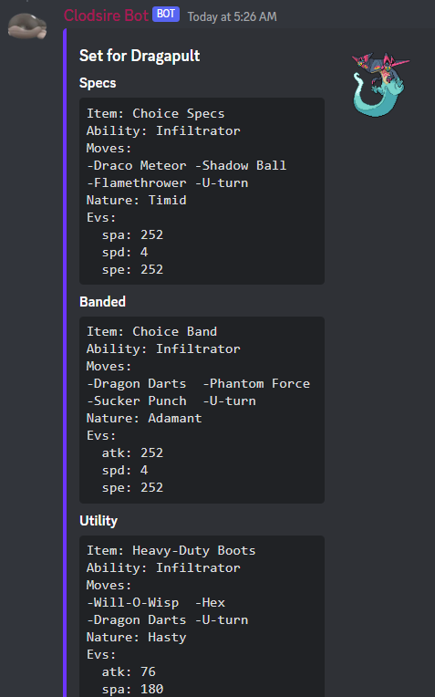
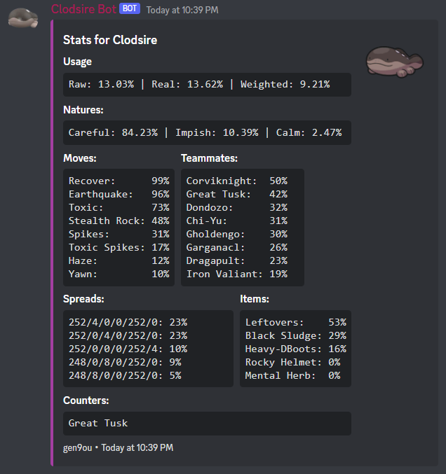

<p align="center">
    
</p>

# Clodsire Bot 

 <br>
a pokemon-oriented discord bot with an emphasis on pokemon showdown.

## Setup
1. Download and install [Node.js](https://nodejs.org/en/) Version 18.12.1 or higher
2. Open the ```example.env``` file and rename it to ```.env```
    - Fill in the required tokens and IDs
3. Install required and optional dependecies
```sh
$ npm install
```
4. You should be able to now run the bot using:
```sh
$ npm run deployandstart
```


## Features
* Automatically accounts for spelling mistakes and abreviating of Pokemon names
* Automatically updated with the most recent usage data sourced from https://pkmn.github.io/smogon/data/

## Commands
* [Display](#display)
* [Weaknesses](#weaknesses)
* [Sets](#sets)
* [Stats](#stats)
* [Top](#top)
* [Info](#info)

### Display
```/display```

Takes in an input pokepast.es and returns a visual display for each Pokemon.


### Weaknesses
```/weaknesses```

Takes in an input pokepast.es or pokemon and returns the type weaknesses for the team and/or individual pokemon(s)


### Sets
```/sets```

Returns a list of possible sets for a given Pokemon.

 <br>

### Stats
```/stats```

Returns a list of possible sets for a given Pokemon.

 <br>

### Top
```/top```

Returns the top 30 most used mons in a give generation and format

 <br>

### Info
```/info```


